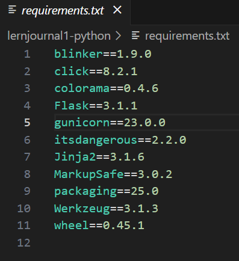
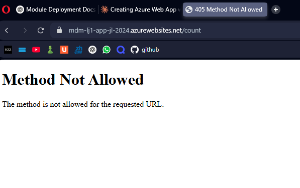

# Lernjournal 1 Python

## Repository und Library

| | Bitte ausfüllen |
| -------- | ------- |
| Repository (URL)  | https://github.com/Justin8228/lernjournal1-python |
| Kurze Beschreibung der App-Funktion | Text-Counter: Zählt Wörter & Zeichen einer Texteingabe |
| Verwendete Library aus PyPi (Name) | Flask, Gunicorn |
| Verwendete Library aus PyPi (URL) | https://pypi.org/project/Flask/    https://pypi.org/project/gunicorn/ |

## App, Funktionalität
Die Text-Counter-App ist eine kleine Flask-Webanwendung mit zwei Routen: Die Root-Route (“/”) liefert das statische Frontend aus dem Ordner static (Datei index.html), die Route “/count” akzeptiert per POST ein JSON-Objekt mit dem Feld text, zerlegt diesen String in Wörter (split()) und zählt mit len() sowohl die Wortanzahl als auch die Zeichenanzahl. Die Ergebnisse werden als JSON mit den Feldern word_count und char_count zurückgegeben.
Unter static/index.html befindet sich eine einfache HTML-Seite, die das Bootstrap-CDN lädt, eine Textarea für die Eingabe, einen Button zum Auslösen der Zählung und einen versteckten Ergebnis-Container umfasst. Das JavaScript in static/script.js lauscht auf Klicks, liest den Text, führt einen fetch-Aufruf an /count durch und zeigt die Antwort (“Wörter: x, Zeichen: y”) im Ergebnis-Container an.

### Dependency Management
Die virtuelle Umgebung (.venv) wird per python -m venv .venv angelegt und in PowerShell mit .venv\Scripts\Activate.ps1 aktiviert. Flask und Gunicorn werden mit pip install flask gunicorn installiert. Mit pip freeze > requirements.txt werden alle verwendeten Versionen in requirements.txt geschrieben. requirements.in bleibt unverändert mit den beiden Top-Level-Packages.

### Lokaler Test
Der Server startet per python app.py auf Port 5000. Ein PowerShell-Aufruf
Invoke-RestMethod -Method POST -Uri http://127.0.0.1:5000/count -ContentType "application/json" -Body '{"text":"Hallo Welt vom Lernjournal"}'
liefert die Antwort
char_count: 26, word_count: 4

Ein einfacher Browser-GET auf denselben Pfad erzeugt einen 405-Fehler („Method Not Allowed“), der die Erreichbarkeit bestätigt.

## Deployment
Ein ZIP-Archiv aller Projektdateien (ohne .venv und .git) dient als Deployment-Package. Zunächst wurden per Azure CLI die Ressourcengruppe mdm-lj1-rg und der kostenlose Linux-App-Plan mdm-lj1-plan angelegt. Die Web-App entstand anschließend mit dem Standardaufruf

az webapp create \
  --resource-group mdm-lj1-rg \
  --plan mdm-lj1-plan \
  --name mdm-lj1-app-jl-2024

Beim Versuch, die Runtime direkt mit --runtime "PYTHON|3.12" zu setzen, verhinderte PowerShell die Übergabe des Pipe-Zeichens und meldete „3.12“ als unbekannten Befehl. Verschiedene Escape- und Parsing-Ansätze (Backtick, Stop-Parsing-Token, einfache vs. doppelte Anführungszeichen) blieben wirkungslos.
Der zuverlässige Workaround bestand darin, die Python-Version nachträglich über die Windows-Command-Shell zu konfigurieren:

cmd /c 'az webapp config set \
  --resource-group mdm-lj1-rg \
  --name mdm-lj1-app-jl-2024 \
  --linux-fx-version "PYTHON|3.12"'

Abschließend erfolgte das eigentliche Deployment des ZIP-Pakets:

az webapp deployment source config-zip \
  --resource-group mdm-lj1-rg \
  --name mdm-lj1-app-jl-2024 \
  --src deployment.zip

Dieser Ablauf führte zu einer erfolgreichen Bereitstellung unter der Python-3.12-Laufzeit und der Status "RuntimeSuccessful" bestätigte, dass die Anwendung nun stabil in der Cloud ausgeführt wird.

## Live Test
Die App ist erreichbar unter https://mdm-lj1-app-jl-2024.azurewebsites.net/count. Ein PowerShell-POST
Invoke-RestMethod -Method POST -Uri https://mdm-lj1-app-jl-2024.azurewebsites.net/count -ContentType application/json -Body '{"text":"Dies ist ein Live-Test"}'
liefert char_count: 22 und word_count: 4

