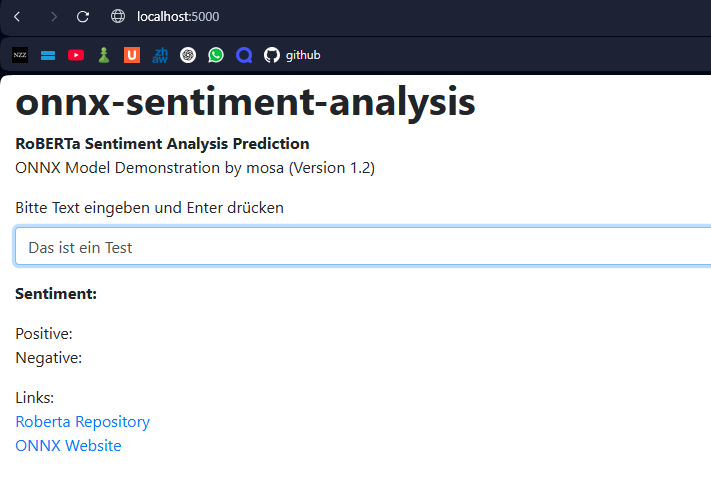
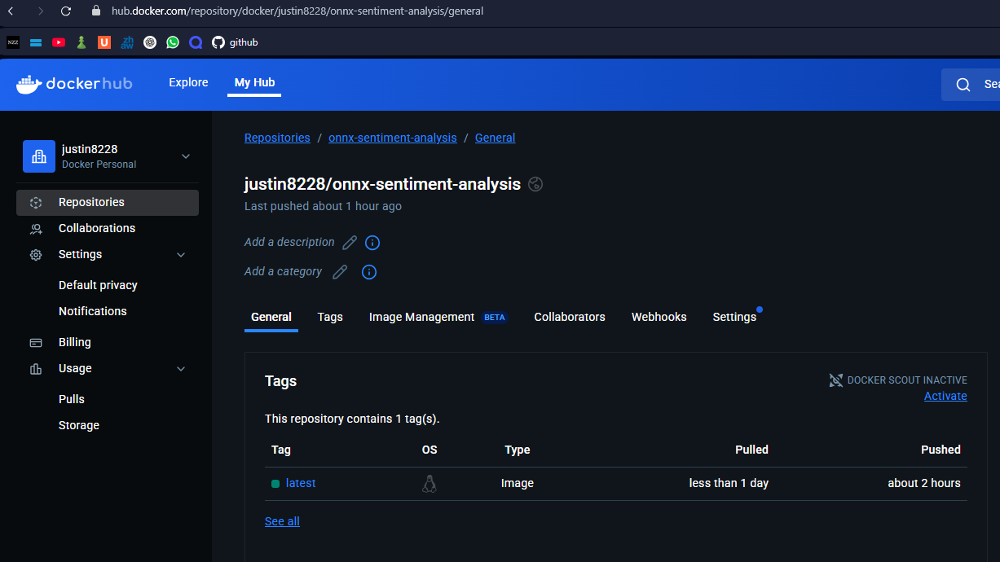

# Lernjournal 2 Container

## Docker Web-Applikation
Ich habe für mein Projekt eine Sentiment-Analyse-Web-Applikation auf Basis von ONNX eingesetzt, die aus zwei Containern besteht: einem Flask-Server mit dem geladenen ONNX-Modell und einer PostgreSQL-Datenbank. Beide Images stammen von Docker Hub – das Datenbank-Image nutze ich direkt aus dem offiziellen Repository, das App-Image habe ich selbst als justin8228/onnx-sentiment-analysis bereitgestellt. Die Einrichtung und Verwaltung beider Dienste erfolgt lokal über Docker Compose, die entsprechende docker-compose.yml ist in meinem GitHub-Fork dokumentiert.

### Verwendete Docker Images

| | Bitte ausfüllen |
| -------- | ------- |
| Image 1 | justin8228/onnx-sentiment-analysis |
| Image 1 |  https://hub.docker.com/r/justin8228/onnx-sentiment-analysis |
| Image 2 | postgres|
| Image 2 | https://hub.docker.com/_/postgres |
| Docker Compose | https://github.com/Justin8228/onnx-sentiment-analysis/blob/master/docker-compose.yml |

### Dokumentation manuelles Deployment

1. **Überblick**
Für dieses Projekt habe ich die vorgegebene ONNX-Sentiment-Analysis-App verwendet und sie in zwei Containern betrieben:

- **sentiment-app**: Flask-Server mit dem ONNX-Modell  
- **sentiment-db**: PostgreSQL-Datenbank

2. **Netzwerk erstellen**
   docker network create sentiment_network
 

3. **PostgreSQL starten**
    docker run -d \
  --name sentiment-db \
  --network sentiment_network \
  -e POSTGRES_USER=sentiment \
  -e POSTGRES_PASSWORD=passwort123 \
  -e POSTGRES_DB=sentiment_db \
  -p 5432:5432 \
  postgres
    

4. **Sentiment App Starten**
    docker run -d \
  --name sentiment-app \
  --network sentiment_network \
  -p 5000:5000 \
  justin8228/onnx-sentiment-analysis:latest
    

5. **Funktionstest im Browser:** http://localhost:5000

#### Erkenntnis

Beim manuellen Deployment lief alles wie erwartet, bis der ONNX-Download im laufenden Container mehrfach abbrach und den Start verzögerte. Das hat gezeigt, dass einzelne Schritte händisch fehleranfällig sind und sich der Modell-Download besser ins Image-Build verschieben lässt.

### Dokumentation Docker-Compose Deployment

1. **`docker-compose.yml` erstellen**

    version: '3.8'

services:
  db:
    image: postgres
    container_name: sentiment-db
    restart: always
    environment:
      POSTGRES_USER: sentiment
      POSTGRES_PASSWORD: passwort123
      POSTGRES_DB: sentiment_db
    ports:
      - "5432:5432"

  app:
    image: justin8228/onnx-sentiment-analysis:latest
    container_name: sentiment-app
    restart: always
    depends_on:
      - db
    environment:
      DB_HOST: db
      DB_USER: sentiment
      DB_PASS: passwort123
      DB_NAME: sentiment_db
    ports:
      - "5000:5000" 

2. **Container mit Docker-Compose starten**  
    docker-compose up -d
    
   
   

3. **App Browser aufrufen:** http://localhost:5000

4. **Container stoppen (falls nötig)**  
    docker-compose down
    

#### Erkenntnis

Beim Compose-Deployment starteten beide Dienste fehlerfrei parallel, und die Abhängigkeiten (DB vor App) wurden automatisch berücksichtigt. So war die Inbetriebnahme deutlich schneller und weniger fehleranfällig als beim manuellen Ansatz.

## Deployment ML-App

Ich habe die ONNX-Sentiment-Analysis-Anwendung gewählt und sowohl ein GitHub-Repository als auch ein Docker-Hub-Repository dafür erstellt.

### Variante und Repository

| Gewähltes Beispiel | Bitte ausfüllen |
| -------- | ------- |
| onnx-sentiment-analysis | Ja |
| onnx-image-classification | Nein |
| Repo URL Fork | https://github.com/Justin8228/onnx-sentiment-analysis|
| Docker Hub URL | https://hub.docker.com/r/justin8228/onnx-sentiment-analysis |

### Dokumentation lokales Deployment

1. **Docker Run**  
    docker run --name sentiment-app -p 5000:5000 -d justin8228/onnx-sentiment-analysis:latest
      

2. **Server Startup Log**  
    docker logs sentiment-app
     

3. **Lokal im Browser aufrufen**  
   http://localhost:5000

4. **Docker Push auf Docker Hub**  
    docker push justin8228/onnx-sentiment-analysis:latest
     
    

#### Erkenntnis

Beim lokalen Deployment der Sentiment-App lief der Container schnell hoch und das ONNX-Modell wurde beim ersten Start korrekt heruntergeladen, ohne dass weitere Konfigurationsschritte nötig waren. Das Live-Logging über docker logs half, etwaige Download-Probleme sofort zu erkennen, und der anschließende Push zu Docker Hub stellte sicher, dass das Image problemlos geteilt werden kann

### Dokumentation Deployment Azure Web App

1. **Azure Login**  
    az login
    

2. **Resource Group erstellen**  
    az group create --name mdm-appservice --location switzerlandnorth
     

3. **App Service Plan erstellen**  
    az appservice plan create \
  --name sentiment-plan \
  --resource-group mdm-appservice \
  --sku F1 \
  --is-linux
    

4. **Web App erstellen**  
    az webapp create \
  --resource-group mdm-appservice \
  --plan sentiment-plan \
  --name sentiment-onnx-app \
  --deployment-container-image-name justin8228/onnx-sentiment-analysis:latest
      

5. **Bereitgestellte App**
https://sentiment-onnx-app.azurewebsites.net

#### Erkenntnis

Das Deployment als Azure Web App war in wenigen Schritten möglich und stellt den Container automatisch bereit und skaliert ihn bei Bedarf – ideal für einfache produktive Szenarien.

### Dokumentation Deployment ACA

1. **Resource Group erstellen**  
    az group create --location switzerlandnorth --name mdm-aca
      

2. **Container App Environment erstellen**  
    az containerapp env create \
  --name sentiment-env \
  --resource-group mdm-aca \
  --location westeurope
      

3. **Container App erstellen**  
    az containerapp create \
  --name sentiment-aca-app \
  --resource-group mdm-aca \
  --environment sentiment-env \
  --image justin8228/onnx-sentiment-analysis:latest \
  --target-port 5000 \
  --ingress external \
  --query properties.configuration.ingress.fqdn
      

4. **Bereitgestellte App**
https://sentiment-aca-app.your-env-hash.westeurope.azurecontainerapps.io

#### Erkenntnis
Mit Azure Container Apps lässt sich die Sentiment-Analysis-Anwendung ohne Server‐Management deployen. Die Umgebung skaliert automatisch und trennt Infrastruktur von Code, was den Betrieb moderner Microservices vereinfacht.

### Dokumentation Deployment ACI

1. **Resource Group erstellen**  
    az group create --location switzerlandnorth --name mdm-aci
      

2. **Container Instance-Provider registrieren**  
    az provider register --namespace Microsoft.ContainerInstance
    

3. **Container erstellen**
    az container create \
  --resource-group mdm-aci \
  --name sentiment-aci-app \
  --image justin8228/onnx-sentiment-analysis:latest \
  --dns-name-label sentiment-aci-app \
  --ports 5000 \
  --os-type Linux \
  --cpu 1 \
  --memory 1.5
    

4. **Bereitgestellte App**
http://sentiment-aci-app.switzerlandnorth.azurecontainer.io:5000

#### Erkenntnis
Azure Container Instances ermöglicht ein sehr schnelles, einfaches Deployment ohne Infrastruktur-Setup. Es eignet sich ideal für Test- und Entwicklungsumgebungen, da der Container innerhalb weniger Sekunden lauffähig ist und direkt über eine öffentliche DNS-Adresse erreichbar ist.
