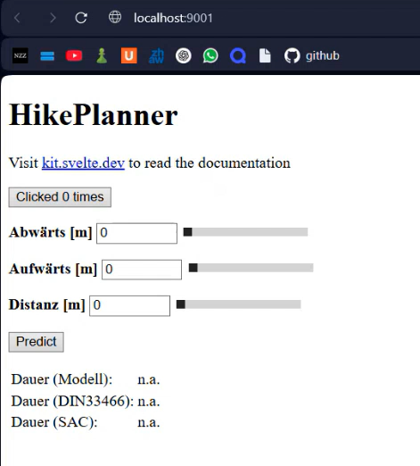

# Projekt 1 Python

## Übersicht

| | Bitte ausfüllen |
| -------- | ------- |
| Variante | Vorlesungsbeispiel |
| Datenherkunft | GeoJSON, GPX |
| Datenherkunft | http://www.hikr.org/filter.php?act=filter&a=ped&ai=100&aa=630 |
| ML-Algorithmus | Lineare Regression & Gradient Boosting Regressor |
| Repo URL | https://github.com/Justin8228/HikePlanner |

## Dokumentation

### Data Scraping

1. Repo des Dozenten wurde geforked
2. Daten (GPX Files) wurden über gethikrdata.py mit einem Spider Modul gescraped. Die Daten kommen direkt von der Hikr Webseite mit voreingestellten Filtern (in der URL ersichtlich). Die Filter sorgen dafür, dass alle Daten im GeoJSON Format angezeigt werden, um sie prepariert ins Projekt zu integrieren. Hier gab es diverse Probleme, da ich die falsche Scrapy Version verwendet hatte. Mit einem Hinweis vom Dozenten, wurde der Fehler festgestellt und die gescrapten Daten konnten in das file.fl geladen werden. 

Beispiel Log:
(.venv) PS C:\Users\justi\OneDrive\Desktop\Justin\Studium\Hauptstudium\6. Semester\Model Deployment & Maintenance\Projekt 1\hikeplanner\spider> scrapy crawl gpx -s CLOSESPIDER_PAGECOUNT=10 -o file.jl
2025-04-03 18:15:13 [scrapy.utils.log] INFO: Scrapy 2.12.0 started (bot: spider)
2025-04-03 18:15:14 [scrapy.utils.log] INFO: Versions: lxml 5.3.0.0, libxml2 2.11.7, ...
2025-04-03 18:15:14 [scrapy.crawler] INFO: Overridden settings:
{'BOT_NAME': 'spider',
 'CLOSESPIDER_PAGECOUNT': '10',
 'DOWNLOAD_DELAY': 2,
 'FEED_EXPORT_ENCODING': 'utf-8',
 ...}
2025-04-03 18:15:21 [scrapy.core.engine] DEBUG: Crawled (200) <GET https://www.hikr.org/filter.php?act=filter&a=ped&ai=100&aa=630>
2025-04-03 18:15:29 [scrapy.core.engine] DEBUG: Crawled (200) <GET https://www.hikr.org/tour/post193139.html>
2025-04-03 18:15:32 [scrapy.pipelines.files] DEBUG: File (downloaded): Downloaded file from <GET https://f.hikr.org/files/gps66307.gpx>
2025-04-03 18:15:32 [scrapy.core.scraper] DEBUG: Scraped from <200 https://www.hikr.org/tour/post193139.html>
{'file_urls': ['https://f.hikr.org/files/gps66307.gpx'], 'difficulty': 'T2 - Mountain hike', 'user': 'G&R-dragonfly ', 'name': "Traona: l'anello del Vallone", 'url': 'https://www.hikr.org/tour/post193139.html', 'files': [{'url': 'https://f.hikr.org/files/gps66307.gpx', 'path': 'full/50ab20162a4427cc9f4a33710ca20fda3676cbc5', 'checksum': 'cce1a1d11108977a11a9f3de50d6f27b', 'status': 'downloaded'}]}
2025-04-03 18:16:13 [scrapy.statscollectors] INFO: Dumping Scrapy stats:
{'file_count': 11,
 'item_scraped_count': 11,
 'finish_reason': 'closespider_pagecount'}
2025-04-03 18:16:13 [scrapy.core.engine] INFO: Spider closed (closespider_pagecount)

3. Über Azure wurde dann eine MongoDB Datenbank eingerichtet. Die gescrapten daten wurden dann über mongo_import.py darin abgelegt.

### Training

Für die Vorhersage der Wanderdauer wurde ein Regressionsmodell entwickelt, das verschiedene Streckenmerkmale berücksichtigt, wie z. B. Höhenmeter, Streckenlänge oder Durchschnittsgeschwindigkeit. Ziel war es, ein Modell zu trainieren, das präzise die erwartete Zeitdauer einer Wanderung vorhersagen kann.
Die Trainingsdaten wurden zuvor mithilfe eines Scrapy-Spiders von der Plattform hikr.org gesammelt. Jede Instanz bestand aus einem vollständigen Datensatz mit Informationen zur Wanderung sowie zugehörigen GPX-Dateien. Diese Daten wurden anschließend über ein Python-Skript in eine Azure CosmosDB im MongoDB-Format geladen. Die Datenvorbereitung und -bereinigung fand im Jupyter-ähnlichen Modellierungsskript model.py statt.
Folgende Merkmale wurden als Trainingsinput genutzt:

uphill (positive Höhenmeter)

downhill (negative Höhenmeter)

length_3d (Streckenlänge in Metern, 3D berechnet)

avg_speed (durchschnittliche Geschwindigkeit in m/s)

Diese Features wurden in einem DataFrame normalisiert, um das Training zu stabilisieren und Verzerrungen durch stark unterschiedliche Skalen zu vermeiden.

Zur Bewertung wurden zwei Metriken verwendet:

R²-Score: 0.89 (Trainingsdaten), 0.99 (Testdaten)

Mean Squared Error (MSE): ca. 3.2 Mio (Train), ca. 245 000 (Test)

Die hohe Güte auf dem Testset weist auf eine gute Generalisierung hin, wobei die Diskrepanz zwischen Train und Test auf mögliches Overfitting hindeutet. Weitere Feinjustierungen wie Cross-Validation wären als nächster Schritt sinnvoll.

### ModelOps Automation

In diesem Projekt wurde das Modelltraining mit einem einfachen, aber funktionalen Automatisierungsansatz ergänzt. Ziel war es, die neu trainierten Modelle automatisch zu versionieren und in Azure Blob Storage hochzuladen. Dadurch kann jederzeit nachvollzogen werden, wann welches Modell mit welchen Daten trainiert wurde, ohne lokal Dateien verwalten zu müssen.

Beim Ausführen des Skripts save_model.py werden das trainierte Modell sowie die zugehörige Heatmap und Konfigurationsdaten automatisch in einen Container auf Azure hochgeladen. Dabei wird jedes neue Modell mit einer inkrementellen Versionsnummer versehen (z. B. hikeplanner-model-v1, hikeplanner-model-v2), um ältere Versionen bei Bedarf vergleichen oder wiederherstellen zu können.

Die Verbindung zu Azure erfolgt über eine Verbindungszeichenfolge, die per Kommandozeile übergeben wird. Der ganze Vorgang – Modell laden, umbenennen, hochladen – passiert in wenigen Sekunden und kann bei jedem neuen Training oder nach Datenupdates wiederholt werden.

Diese Automatisierung reduziert manuellen Aufwand und sorgt dafür, dass immer ein aktueller und konsistenter Modellstand verfügbar ist – besonders wichtig, wenn das Projekt später produktiv oder iterativ erweitert werden soll.

### Deployment

Im Rahmen des Projekts wurde die entwickelte Web-API mithilfe von Azure Container Instances öffentlich bereitgestellt. Die Anwendung basiert auf einem Flask-Endpunkt und verarbeitet HTTP-Requests über die Route /predict, um auf Grundlage von eingegebenen Parametern wie Uphill, Downhill und Streckenlänge eine Zeitprognose für Wanderungen zu liefern. Das zugehörige Modell wird beim Start der API automatisch aus Azure Blob Storage geladen, wobei die Zugriffsdaten über eine Umgebungsvariable zur Verfügung gestellt werden.

Für das Deployment wurde lokal ein Docker-Image gebaut und anschliessend mit der Azure CLI in einen Container überführt. Dabei wurde ein DNS-Label vergeben, um die API über das Internet erreichbar zu machen. Der vollständige Vorgang lief weitgehend reibungslos ab, erforderte jedoch einzelne Anpassungen: So wurde der Verbindungsaufbau zum Blob Storage zunächst durch einen falsch gesetzten Connection String verhindert. Nachdem dieser direkt im az container create-Befehl als Umgebungsvariable eingebunden wurde, konnte die App wie geplant starten. Ein weiteres Problem trat beim Ausführen der Flask-Anwendung innerhalb des Containers auf. Obwohl das Skript lokal ohne Fehler funktionierte, reagierte es im Container nicht wie erwartet. Die Ursache lag im Dockerfile, das einen veralteten CMD-Eintrag enthielt. Nach Anpassung konnte die API auch im Container korrekt ausgeführt werden.

Abschliessend wurde die Anwendung erfolgreich deployed und ist nun über eine öffentliche URL aufrufbar. Damit ist die letzte Phase des Projekts – das Deployment – abgeschlossen, und die trainierten Modelle sind produktiv im Einsatz. Durch diese Bereitstellung ist sichergestellt, dass externe Anwendungen oder Benutzer automatisiert auf die Vorhersagefunktion zugreifen können.

